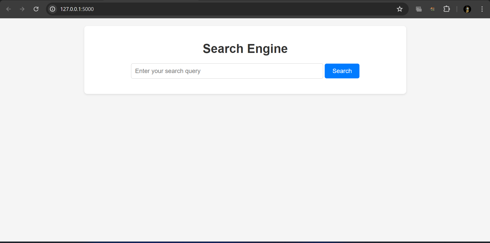
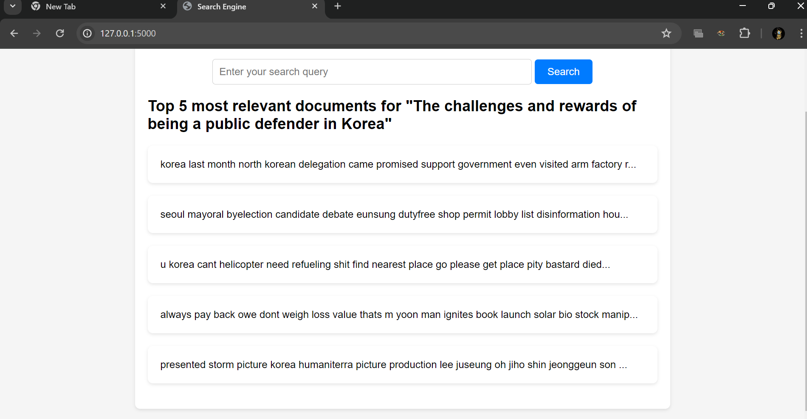

# Project Name: Enhancing Search Engine Relevance for Video Subtitles

## Overview:
This project focuses on enhancing the relevance and accuracy of search results for video subtitles. By leveraging natural language processing (NLP) and machine learning (ML) techniques, the search engine retrieves subtitles based on user queries, making video content more accessible.

## Features:
- **Advanced Search Algorithm**: Utilizes NLP and ML techniques to improve search relevance.
- **Keyword vs Semantic Search**: Implements both keyword-based and semantic-based search approaches.
- **Document Chunker**: Divides large documents into smaller chunks for efficient embedding and retrieval.
- **Cosine Similarity Calculation**: Computes similarity scores between user queries and document embeddings.
- **ChromaDB Database**: Stores embeddings for fast retrieval and scalability.

## Screenshots:

## Demo Video:
[Link to Demo Video](https://drive.google.com/file/d/1pwHPYD7jRFyzRl7OntlApgRCwDw1ZzpX/view?usp=sharing)

## Requirements:
- Python 3.x
- Libraries: NumPy, Pandas, NLTK, SentenceTransformers, etc. (List dependencies in requirements.txt)

## Setup:
1. Clone the repository: `git clone https://github.com/Swastik-Dubey/searchengine.git`
2. Install dependencies: `pip install -r requirements.txt`
3. Run the project: `python app.py`

## Usage:
1. Ingesting Documents:
   - Read the data from the provided database file.
   - Clean the subtitle documents and preprocess them as needed.
   - Generate text vectors using BOW, TFIDF, or SentenceTransformers.
   - Divide large documents into smaller chunks using the Document Chunker.

2. Retrieving Documents:
   - Take the user's search query.
   - Preprocess the query if required.
   - Create a query embedding.
   - Calculate cosine similarity scores between document embeddings and the user query.
   - Return the most relevant documents based on similarity scores.

## Credits:
- Project developed by [Swastik-Dubey](https://github.com/Swastik-Dubey) and [H Annapoorneshwari](https://github.com/Anu0907) during internship at Innomatics Research Labs.
- Special thanks to the team at Innomatics Research Labs for their guidance and support.

---
Feel free to reach out for any questions or suggestions! 🚀

